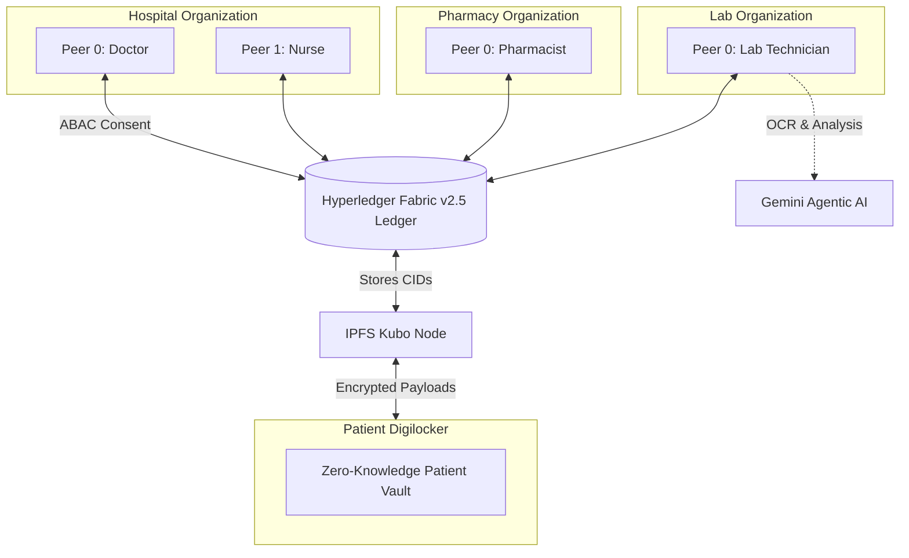

# 🏥 Enterprise Blockchain Electronic Health Record (EHR) System

     

## 📌 Executive Summary

The **Blockchain Electronic Health Record (EHR) System** is a decentralized, enterprise-grade healthcare federation built on Hyperledger Fabric v2.5. By uniting independent stakeholders (Hospital, Pharmacy, Lab, and Digilocker) on a shared immutable ledger, it solves critical challenges in data fragmentation, single points of failure, and unauthorized access. The architecture strictly enforces Attribute-Based Access Control (ABAC) and cryptographically guaranteed patient sovereignty, ensuring medical records are only accessible with explicit, on-chain consent.

---

## 🧬 High-Level Architecture

The network connects 4 distinct Agentic Peer roles across multiple autonomous organizations:



---

## 📦 Folder Structure

```text
EHR_blockchain/
├── orgs/
│   ├── hospital/         # 🏥 Hospital Organization (Backend, UIs, Fabric Network)
│   ├── pharmacy/         # 💊 Pharmacy Organization (Swarm Network, UIs, APIs)
│   ├── lab/              # 🧪 Lab Organization (Analysis, OCR, IPFS Gateway)
│   └── digilocker/       # 🔐 Digilocker System (Patient Data Vault)
├── docker-compose.yaml   # Orchestrates all Node.js/React containers
├── start-all.sh          # 🚀 Unified deployment orchestrator script
└── start-sequential.ps1  # Native Windows alternative startup script
```

---

## ⚙️ Updated Implementation Details

We have recently upgraded the core infrastructure to support robust distributed environments and advanced AI workloads:

* **`start-all.sh` Orchestration Sequence**: A universal initialization script that dynamically resolves paths, injects environment variables, boots the Hyperledger Fabric nodes (Hospital -> Pharmacy -> Lab), and orchestrates the frontend/backend apps via Docker Compose.
* **4 Distinct Agentic Peer Roles**: Granular ABAC enforcement is now mapped to specific peers: **Doctor** (diagnostics/prescriptions), **Nurse** (vital signs), **Pharmacy** (inventory/dispensing), and **Lab** (test execution and AI-assisted result uploads).
* **Asynchronous IPFS & OCR Processing**: The `POST /api/records/ipfs` routes have been refactored. Heavy PDF OCR extraction (Tesseract.js) and IPFS pinning are now executed in background threads, returning `202 Accepted` immediately to prevent frontend HTTP timeouts on large medical files.
* **Dynamic Environment Variables in Docker Swarm**: Swarm cluster networking is fully dynamic. Files like `hosts.final` rely on environment variable substitution (`${MACHINE1_IP}`, etc.) instead of hardcoded IPs, allowing seamless deployment across dynamic distributed servers.
* **Roadmap: VCAP and FHIR R4 Interoperability**: Upcoming milestones include native FHIR R4 standard conversions for all on-chain payloads and Verifiable Clinical AI Provenance (VCAP) to cryptographically trace and audit Gemini AI-generated diagnostic recommendations.

---

## 🚀 Quickstart Setup for Team Members

We have fully dockerized this project using **GitHub Container Registry (GHCR)**. 
**You do NOT need to install Node.js or run `npm install`.**

### Step 1: Open Docker
Ensure **Docker Desktop** is running.

### Step 2: Download the Code & Fabric Binaries
Open a terminal (WSL Ubuntu or Git Bash) in the project root. Make sure your Fabric Binaries are installed per the setup guide. 

Run the automated orchestrator to boot everything:
```bash
bash start-all.sh
```

### Step 3: Access the Portals
Once the containers are healthy, access the portals at:
* **Hospital UIs:** `http://localhost:5173` (Reception) | `http://localhost:5174` (Patient)
* **Pharmacy UIs:** `http://localhost:3001` through `3005`, and `5175`
* **Lab Gateway:** `http://localhost:3006`

> [!WARNING]
> **Windows & OneDrive Users:** 
> Do **NOT** clone or extract this repository into a folder synced by OneDrive. Use a local path (e.g., `C:\Projects\`).

## 🛠 For Developers

* **Hot Reloading:** Your local folders are actively bind-mounted into the containers. Vite HMR is fully supported through Nginx.
* **Dependencies:** If you modify `package.json`, commit it to `main`. Our CI/CD will rebuild the images. Run `docker compose pull && docker compose up -d` to sync.
