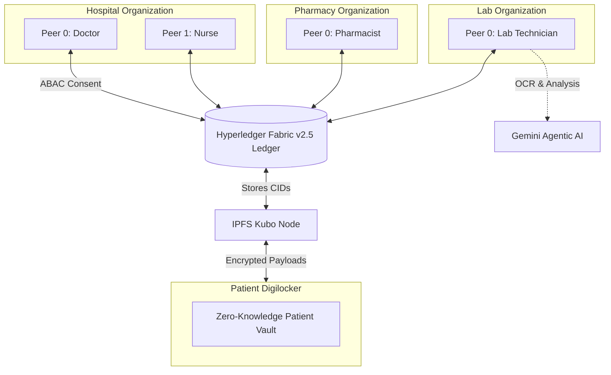
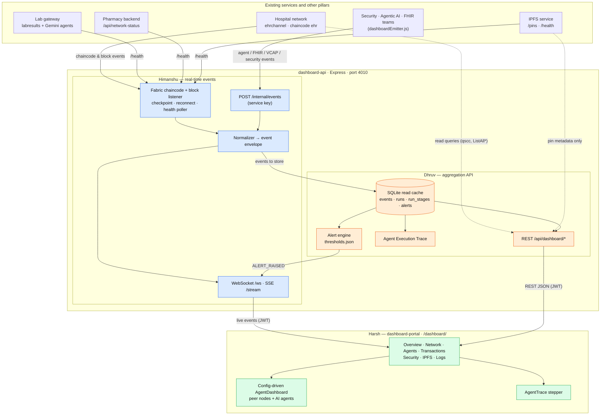
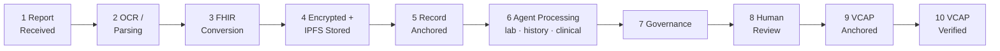

# 🏥 Enterprise Blockchain Electronic Health Record (EHR) System

     

## 📌 Executive Summary

The **Blockchain Electronic Health Record (EHR) System** is a decentralized, enterprise-grade healthcare federation built on Hyperledger Fabric v2.5. By uniting independent stakeholders (Hospital, Pharmacy, Lab, and Digilocker) on a shared immutable ledger, it solves critical challenges in data fragmentation, single points of failure, and unauthorized access. The architecture strictly enforces Attribute-Based Access Control (ABAC) and cryptographically guaranteed patient sovereignty, ensuring medical records are only accessible with explicit, on-chain consent.

---

## 🧬 High-Level Architecture

The network connects 4 distinct Agentic Peer roles across multiple autonomous organizations:



---

## 📦 Folder Structure

```text
EHR_blockchain/
├── orgs/
│   ├── hospital/         # 🏥 Hospital Organization (Backend, UIs, Fabric Network)
│   ├── pharmacy/         # 💊 Pharmacy Organization (Swarm Network, UIs, APIs)
│   ├── lab/              # 🧪 Lab Organization (Analysis, OCR, IPFS Gateway)
│   └── digilocker/       # 🔐 Digilocker System (Patient Data Vault)
│       # 📊 Group 1 Dashboard (planned): hospital/.../ehr-backend-v3/dashboard-api + ehr-frontend-v2/dashboard-portal
├── docker-compose.yaml   # Orchestrates all Node.js/React containers
├── start-all.sh          # 🚀 Unified deployment orchestrator script
└── start-sequential.ps1  # Native Windows alternative startup script
```

---

## ⚙️ Updated Implementation Details

We have recently upgraded the core infrastructure to support robust distributed environments and advanced AI workloads:

* **`start-all.sh` Orchestration Sequence**: A universal initialization script that dynamically resolves paths, injects environment variables, boots the Hyperledger Fabric nodes (Hospital -> Pharmacy -> Lab), and orchestrates the frontend/backend apps via Docker Compose.
* **4 Distinct Agentic Peer Roles**: Granular ABAC enforcement is now mapped to specific peers: **Doctor** (diagnostics/prescriptions), **Nurse** (vital signs), **Pharmacy** (inventory/dispensing), and **Lab** (test execution and AI-assisted result uploads).
* **Asynchronous IPFS & OCR Processing**: The `POST /api/records/ipfs` routes have been refactored. Heavy PDF OCR extraction (Tesseract.js) and IPFS pinning are now executed in background threads, returning `202 Accepted` immediately to prevent frontend HTTP timeouts on large medical files.
* **Dynamic Environment Variables in Docker Swarm**: Swarm cluster networking is fully dynamic. Files like `hosts.final` rely on environment variable substitution (`${MACHINE1_IP}`, etc.) instead of hardcoded IPs, allowing seamless deployment across dynamic distributed servers.
* **Roadmap: VCAP and FHIR R4 Interoperability**: Upcoming milestones include native FHIR R4 standard conversions for all on-chain payloads and Verifiable Clinical AI Provenance (VCAP) to cryptographically trace and audit Gemini AI-generated diagnostic recommendations.

---

## 📊 Group 1 — Observability Dashboard (Proposed Architecture)

> **Status:** Proposed · Phase 1 (Dashboard Foundation) ≈ 35% complete
> **Pillar:** Dashboard / Observability (1 of 4 — alongside Security, Agentic AI and Standard EHR / FHIR)

Group 1 builds a **read-only observability dashboard** for the whole platform: live Fabric network health, ledger transactions, AI agent executions, IPFS activity and security events in one React app, served at `http://localhost/dashboard/`. It replaces manual page refreshes with **real-time push updates** driven by Fabric chaincode and block events.

### 👥 Team & Tracks

| Member | Track | Novelty |
| :--- | :--- | :--- |
| **Himanshu** | Real-Time Event Architecture & Core Orchestration | WebSocket/SSE gateway fed by a checkpointed Fabric chaincode-event and block listener — no UI polling |
| **Harsh Bhagat** | Frontend Shell & Agentic Peer Dashboards | One configuration-driven `AgentDashboard` that renders every peer node and AI agent with zero duplicated pages |
| **Dhruv Kumarawat** | Backend Aggregation API & Agent Execution Trace | A stage-by-stage Agent Trace stitched from FHIR, AI, IPFS, Fabric and VCAP events for each clinical AI run |

### 🧭 Architecture Diagram



**Flow:** Fabric events and pushed events from other teams → normalizer → live WebSocket stream **and** SQLite read cache → REST API, Agent Trace and alerts → React dashboard. The dashboard never writes to the ledger.

### 🔁 Agent Execution Trace (10 stages, agreed across pillars)



The record is anchored before AI runs (Security's async design), so stages 6–10 can arrive minutes or hours later. Stage statuses: `DONE`, `FAILED`, `SKIPPED`, `PENDING`, `WAITING_HUMAN`. All events for one run share `correlationId` = the AI orchestrator's `runId` = VCAP `executionId`.

### 📨 Common Event Envelope

Every team emits events in this shape (via `dashboardEmitter.js` → `POST /internal/events`, or as Fabric chaincode events):

```json
{
  "eventId": "evt-7f3a9c",
  "eventType": "AGENT_EXECUTION_COMPLETED",
  "timestamp": "2026-09-15T10:20:00Z",
  "source": "lab-agent",
  "org": "DiagnosticsMSP",
  "peerId": "peer0.lab.example.com",
  "severity": "INFO",
  "txId": "a1b2c3...",
  "blockNumber": 1042,
  "correlationId": "RUN-001",
  "payload": { "patientIdHash": "hmac-sha256:...", "recordId": "LAB001", "durationMs": 1840 }
}
```

**Zero-PHI rule:** payloads carry only ids, `patientIdHash`, CIDs, hashes, statuses and timings — never raw patient ids, names, clinical values or AI summary text.

### 🔌 API & Routing

| Route | Owner | Purpose |
| :--- | :--- | :--- |
| `GET /api/dashboard/overview` | Dhruv | KPI cards: block heights, tx/min, peers online, active alerts |
| `GET /api/dashboard/network` | Dhruv | Peers, orderers, CAs, channels, status |
| `GET /api/dashboard/transactions` | Dhruv | Recent ledger writes |
| `GET /api/dashboard/agents` · `/agents/:agentId/executions` | Dhruv | Per-agent metrics and runs |
| `GET /api/dashboard/executions/:runId/trace` | Dhruv | Stage-by-stage Agent Trace |
| `GET /api/dashboard/ipfs` · `/security/events` · `/alerts` | Dhruv | IPFS metadata, audit & security events, alerts |
| `ws://localhost/api/dashboard/ws` · `GET /api/dashboard/stream` | Himanshu | Live event stream (WebSocket / SSE) |
| `POST /internal/events` (not exposed via Nginx) | Himanshu | Ingest endpoint for other teams' events |

| Service | Container | Port | Public URL |
| :--- | :--- | :--- | :--- |
| dashboard-api | `h-dashboard-api` | 4010 | `/api/dashboard/` |
| dashboard-portal | `h-dashboard-portal` | 5176 | `/dashboard/` |

### 📁 Group 1 Folder Structure (planned)

```text
orgs/hospital/EHR_hospitalOrg-main/
├── ehr-backend-v3/dashboard-api/
│   └── src/
│       ├── contracts/     # Event envelope, event registry, response shapes
│       ├── collector/     # Himanshu — Fabric listener, health poller
│       ├── normalizer/    # Himanshu — raw events → envelope
│       ├── realtime/      # Himanshu — WebSocket / SSE gateway
│       ├── routes/        # Dhruv — REST endpoints
│       ├── services/      # Dhruv — network, agents, IPFS, security aggregation
│       ├── store/         # Dhruv — SQLite read cache
│       └── alerts/        # Dhruv — alert engine + thresholds.json
└── ehr-frontend-v2/dashboard-portal/
    └── src/
        ├── pages/         # Harsh — Overview, Network, Agents, Transactions, Security, IPFS, Logs
        ├── components/    # Harsh — MetricCard, StatusBadge, AgentCard, AgentDashboard, AgentTrace
        ├── config/        # Harsh — agentConfig.js (peer + AI agents)
        ├── services/      # API client
        └── hooks/         # useDashboardSocket
```

### 🤝 Integration with the Other Pillars

* **Security:** dashboard-api and the WebSocket use Security's JWT and role claims; consent, record-access, break-glass, VCAP and audit events are displayed, not re-implemented.
* **Agentic AI:** the orchestrator and agents (lab, history, clinical, governance) emit run and step events; the dashboard shows them and the human-review status.
* **Standard EHR / FHIR:** `FHIR_CONVERSION_STARTED / COMPLETED / FAILED` events fill stage 3 of the trace.
* **Chaincode:** one shared `emitEvent(ctx, name, payload)` helper, one event per transaction (Fabric keeps only the last `setEvent`), deployed in a single coordinated upgrade.

---

## 🚀 Quickstart Setup for Team Members

We have fully dockerized this project using **GitHub Container Registry (GHCR)**. 
**You do NOT need to install Node.js or run `npm install`.**

### Step 1: Open Docker
Ensure **Docker Desktop** is running.

### Step 2: Download the Code & Fabric Binaries
Open a terminal (WSL Ubuntu or Git Bash) in the project root. Make sure your Fabric Binaries are installed per the setup guide. 

Run the automated orchestrator to boot everything:
```bash
bash start-all.sh
```

### Step 3: Access the Portals
Once the containers are healthy, access the portals at:
* **Hospital UIs:** `http://localhost:5173` (Reception) | `http://localhost:5174` (Patient)
* **Pharmacy UIs:** `http://localhost:3001` through `3005`, and `5175`
* **Lab Gateway:** `http://localhost:3006`

> [!WARNING]
> **Windows & OneDrive Users:** 
> Do **NOT** clone or extract this repository into a folder synced by OneDrive. Use a local path (e.g., `C:\Projects\`).

## 🛠 For Developers

* **Hot Reloading:** Your local folders are actively bind-mounted into the containers. Vite HMR is fully supported through Nginx.
* **Dependencies:** If you modify `package.json`, commit it to `main`. Our CI/CD will rebuild the images. Run `docker compose pull && docker compose up -d` to sync.
