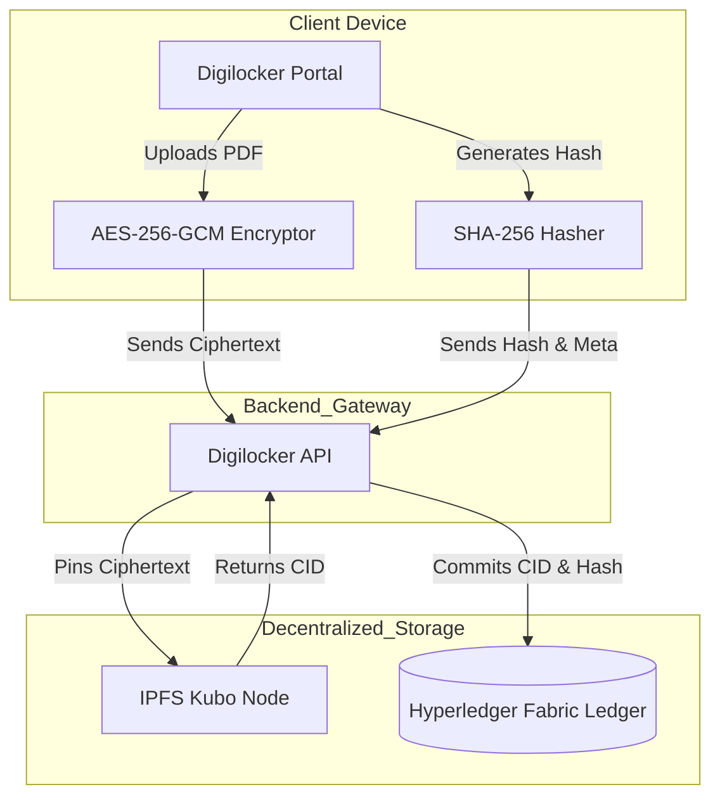

# 🔐 Patient Digilocker Module

    

## 📌 Executive Summary

The **Patient Digilocker Module** enforces ultimate Patient Sovereignty by providing a Zero-Knowledge personal data vault. It guarantees that patient files are encrypted (via AES-256-GCM) on the client side before they ever touch decentralized IPFS storage. Cryptographic hashes and resulting CIDs are immutably anchored to the Hyperledger Fabric ledger, ensuring no single entity—not even the hospital—can alter or read the patient's records without explicit consent.

---

## 🧬 Secure Data Vault Architecture



---

## 📦 Folder Structure

```text
digilocker/
├── chaincode/            # 📜 Smart Contracts anchoring CIDs, Hashes, and Consent
├── backend/              # 🌐 Express API Gateway (IPFS bridging)
└── frontend/             # 📱 React UI for patient access and local decryption
```

---

## ⚙️ Updated Implementation Details

* **Asynchronous Processing**: Inherits the ecosystem's background async workers for IPFS pinning, preventing blocking timeouts on the patient portal.
* **Orchestration**: Natively compatible with the `start-all.sh` global boot sequence. 
* **Dynamic Docker Swarm Env**: Compatible with the ecosystem's dynamic DNS / environment variable approach (`hosts.final`) for zero-friction cloud deployment.
* **Agentic Role Isolation**: Digilocker is functionally isolated from the 4 primary clinical agentic roles (Doctor, Nurse, Pharmacist, Lab). It represents the *Patient* as the ultimate root authority of ABAC grants.
* **Roadmap: FHIR R4 & VCAP**: Moving forward, the Digilocker will natively parse FHIR R4 JSON schemas. The UI will also expose Verifiable Clinical AI Provenance (VCAP) logs, allowing the patient to transparently see when and how Gemini AI interacted with their anonymized records during hospital visits.

---

## 🚀 Quick Start

> **Note:** If you are running `start-all.sh`, the Digilocker stack is automatically orchestrated.

To develop on the Digilocker independently:

```bash
# 1. Start the backend
cd backend
npm install
npm run dev

# 2. Start the frontend
cd ../frontend
npm install
npm run dev
```

The Patient Portal will be available locally via your specified Vite port (defaults to `5176` based on network architecture mappings).
