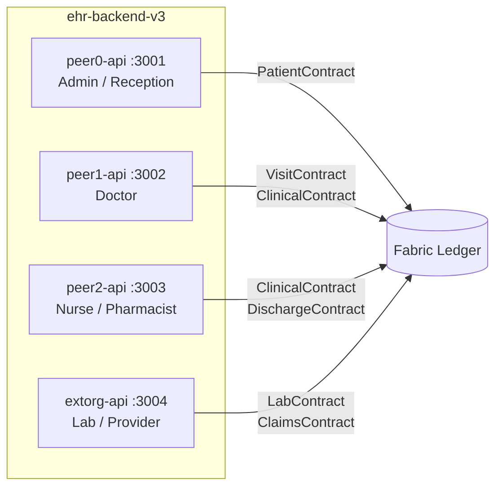

# 🏥 Hospital Backend (ehr-backend-v3)

  

## 📌 Executive Summary
The Hospital Backend acts as the primary API gateway for the Hospital Organization, directly interfacing with the Hyperledger Fabric ledger and IPFS Kubo nodes. It strictly enforces ABAC (Attribute-Based Access Control) through distinct API nodes assigned to specific clinician peers (Peer 0, 1, and 2), ensuring that data ownership and patient sovereignty are immutably logged on-chain.

---

## 🧬 Architecture & Peer Role Mapping

The backend is split into four distinct API nodes corresponding to the specific Agentic Peer roles in the hospital and external org network.



---

## 📦 Folder Structure

```text
ehr-backend-v3/
├── peer0-api/       # 🏢 Receptionist / Admin (Patient Registration, Admissions)
├── peer1-api/       # 🩺 Doctor (Diagnostics, Prescriptions, Referrals)
├── peer2-api/       # 💉 Nurse / Pharmacist (Vitals, Care Notes, Dispensation)
├── extorg-api/      # 🧪 Lab / Provider (Test Results, Insurance Claims)
├── ipfs-service/    # 📂 IPFS integration & OCR async workers
└── generate_hashes.sh # Utility to generate bcrypt credentials
```

---

## ⚙️ Updated Implementation Details

* **Asynchronous Background Processing for IPFS/OCR**: Replaced blocking file uploads with a `202 Accepted` async pattern. Large medical PDFs are processed in the background (Tesseract.js OCR and IPFS pinning) to completely eliminate HTTP timeouts.
* **4 Distinct Agentic Peer Roles**: APIs strictly segregate endpoints based on ABAC identities (Doctor, Nurse, Pharmacy, Lab). E.g., only a Doctor interacting through `peer1-api` can modify the `ClinicalContract`.
* **Dynamic Docker Swarm Environments**: Uses environment variables (like `${MACHINE1_IP}` in `hosts.final`) rather than hardcoded IPs for seamless multi-host deployment.
* **Orchestration**: Fully compatible with the global `start-all.sh` orchestration sequence. 
* **Roadmap: VCAP and FHIR R4**: We are integrating Verifiable Clinical AI Provenance (VCAP) for tracking AI-assisted diagnostics, alongside a native FHIR R4 interoperability layer.

---

## 🚀 Quick Start

> **Note:** For the automated containerized flow, simply run `bash start-all.sh` from the project root.

To run manually for local development:
```bash
# 1. Install dependencies
for API in peer0-api peer1-api peer2-api extorg-api; do
  cd $API && npm install && cd ..
done

# 2. Setup environments
for API in peer0-api peer1-api peer2-api extorg-api; do
  cp $API/.env.example $API/.env
done

# 3. Generate Auth Hashes & Start
bash generate_hashes.sh
cd peer0-api && npm start   # :3001
cd peer1-api && npm start   # :3002
cd peer2-api && npm start   # :3003
cd extorg-api && npm start  # :3004
```

---

## 📜 Chaincode Contract Namespaces

Functions must be called with the contract prefix:

| Contract | Prefix | Handled by |
|----------|--------|-----------|
| **PatientContract** | `PatientContract:` | peer0-api, peer1-api |
| **VisitContract** | `VisitContract:` | peer0-api, peer1-api, peer2-api, extorg-api (read) |
| **ForwardContract** | `ForwardContract:` | peer1-api, peer2-api, extorg-api |
| **ClinicalContract** | `ClinicalContract:` | peer1-api, peer2-api |
| **LabContract** | `LabContract:` | extorg-api |
| **DischargeContract**| `DischargeContract:` | peer2-api, peer0-api (discharge) |
| **ClaimsContract** | `ClaimsContract:` | extorg-api |
