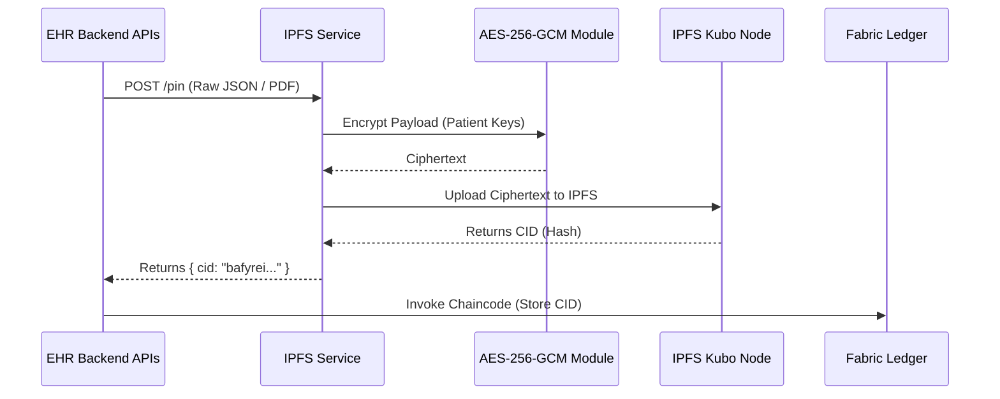

# 📂 IPFS Storage & OCR Service

   

## 📌 Executive Summary
The IPFS Storage & OCR Service is a dedicated microservice that bridges the EHR Backend with the decentralized IPFS Kubo node. It handles the heavy lifting of securely encrypting medical records (via AES-256-GCM), performing asynchronous OCR on clinical images, and generating immutable Content Identifiers (CIDs) that are subsequently stored on the Hyperledger Fabric ledger to prevent data tampering.

---

## 🧬 Secure IPFS Pinning Architecture

This service ensures that all data entering IPFS is cryptographically secured (Zero-Knowledge) before leaving the hospital's private network.



---

## 📦 Folder Structure

```text
ipfs-service/
├── src/
│   ├── routes.js       # Core Express routes (/pin, /fetch, /ehr/init)
│   ├── ipfsClient.js   # Kubo API wrapper & HTTP client
│   ├── crypto.js       # AES-256-GCM encryption/decryption logic
│   └── ocrWorker.js    # Background async Tesseract.js processing
├── .env.example        # Environment variable templates
└── package.json        # Dependencies (Tesseract.js, ipfs-http-client)
```

---

## ⚙️ Updated Implementation Details

* **Asynchronous IPFS/OCR (Background Workers)**: Previously, large file uploads caused HTTP timeouts. The service now utilizes a `202 Accepted` pattern—firing off the intensive Tesseract.js OCR extraction and IPFS pinning to background async queues while immediately acknowledging the upload.
* **AES-256-GCM Native Encryption**: All medical data is encrypted natively before interacting with IPFS. This enforces Patient Sovereignty, as leaked CIDs are mathematically useless without the patient's cryptographic grant.
* **Swarm Ready**: Dynamically interfaces with IPFS Gateways via Docker Swarm environment variables rather than hardcoded URLs.

---

## 📡 API Reference & Routing

The service runs internally on **Port `3006`**. All routes (except `/health`) require the `X-IPFS-Key` header matching your environment's `IPFS_SERVICE_KEY`.

| Method | Path | Purpose |
|--------|------|---------|
| **GET** | `/health` | IPFS node status (no auth) |
| **POST** | `/pin` | Encrypt & pin any JSON/Binary object, returns CID |
| **GET** | `/fetch/:cid` | Fetch & decrypt JSON by CID |
| **POST** | `/ehr/init` | Create + pin empty EHR template |
| **POST** | `/visit/init` | Create + pin empty visit JSON |
| **POST** | `/unpin` | Unpin a CID (careful — keeps history) |
| **GET** | `/pins` | List all pinned CIDs (debug) |

---

## 🚀 Quick Start

> **Note:** If you are running `start-all.sh`, this service boots automatically in the background.

To run manually:
```bash
cp .env.example .env
# Edit .env — set IPFS_API_URL and IPFS_SERVICE_KEY
npm install
npm start
```
