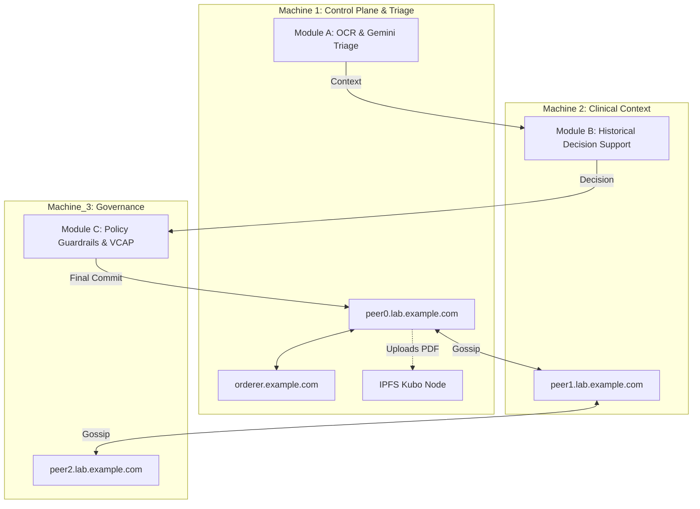

# 🧪 Lab Organization Module

    

## 📌 Executive Summary

The **Lab Organization Module** operates a highly sophisticated `1 peer org + 1 orderer org` Fabric sub-network spanning three dedicated machines. It ingests test requests from the hospital, performs asynchronous OCR (Tesseract.js) and Gemini Agentic AI analysis on clinical PDFs, pins the encrypted payloads to IPFS, and securely commits immutable diagnostic metadata to the blockchain.

---

## 🧬 Network Architecture & AI Triaging

The architecture splits governance, inference, and ledger committing across three physical/virtual nodes for high availability and strict auditability.



---

## 📦 Folder Structure

```text
EHR-LABORG-main/
├── chaincode/
│   └── lab-results/      # 📜 Smart Contract for Lab Result transactions
├── client/
│   └── node-gateway/     # 🌐 React Dashboard & Express API (Gemini/IPFS logic)
├── config/               # ⚙️ Fabric configtx.yaml & crypto-config.yaml
├── docker/               # 🐳 Docker Compose templates per machine
├── env/                  # 🔐 Dynamic environment variables (machine1.env, etc.)
├── scripts/              # 🚀 Chaincode lifecycle and channel join scripts
└── templates/
    └── hosts.final       # 🌐 Dynamic DNS host mappings (${MACHINE1_IP}, etc.)
```

---

## ⚙️ Updated Implementation Details

* **Asynchronous Background Processing for IPFS/OCR**: Replaced the legacy synchronous `POST /api/records/ipfs` route. Heavy Tesseract.js PDF extractions and IPFS pinning now execute in an asynchronous background queue, returning `202 Accepted` to guarantee zero UI blocking.
* **Dynamic Environment Variables in Docker Swarm (`hosts.final`)**: `127.0.0.1` hardcoded IPs have been fully migrated to dynamic variables (`${MACHINE1_IP}`, `${MACHINE2_IP}`, `${MACHINE3_IP}`). The module auto-resolves across distributed environments seamlessly.
* **Missing Binaries Auto-Fetch**: Upgraded `common.sh` to automatically download missing Hyperledger Fabric binaries instead of hard-failing during startup.
* **Agentic Peer Role (Lab)**: Operates the dedicated Lab Agent role in the 4-peer network architecture. Responsible for securely bridging raw clinical evidence (PDFs) with the immutable ledger.
* **Roadmap: VCAP and FHIR R4 Interoperability**: Lab payloads are actively being transitioned to the FHIR R4 standard. We are also integrating Verifiable Clinical AI Provenance (VCAP) into Machine 3 (Module C) to cryptographically trace all Gemini-generated clinical decision support prompts and outputs.

---

## 🚀 Quick Start (Universal Orchestrator)

If deploying the entire federated network, simply execute the global orchestrator from the project root:
```bash
bash start-all.sh
```

### Standalone Distributed Deployment

To run the Lab network across 3 distinct VMs/machines:

**1. Machine 1 (Control Plane)**
```bash
./scripts/download-fabric.sh
./scripts/generate-artifacts.sh
./scripts/start-machine1.sh
./scripts/create-channel.sh
```
*Copy the repository to Machine 2 and 3 after generation.*

**2. Machine 2 (Context Peer)**
```bash
./scripts/download-fabric.sh
./scripts/start-machine2.sh
./scripts/join-channel.sh peer1
```

**3. Machine 3 (Governance Peer)**
```bash
./scripts/download-fabric.sh
./scripts/start-machine3.sh
./scripts/join-channel.sh peer2
```

### Accessing the Portals
Once the Node.js Gateway is active:
* **Lab Gateway Dashboard**: `http://localhost:3000` (or your Machine 1 IP)
* **Hyperledger Explorer**: `http://localhost:8081`
* **IPFS Gateway**: `http://localhost:8080/ipfs`
