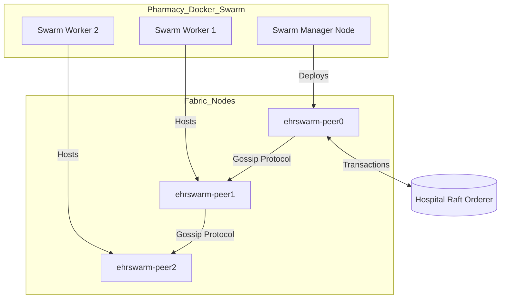

# 💊 Pharmacy Organization Module

   

## 📌 Executive Summary

The **Pharmacy Organization Module** operates as an autonomous node on the wider EHR Blockchain Network, utilizing Docker Swarm to achieve high availability. It strictly manages pharmaceutical inventory, secures prescription fulfillment, and restricts billing/dispensation actions via ABAC (Attribute-Based Access Control) to authorized Pharmacist Agentic Peers. 

---

## 🧬 Swarm Architecture & Peer Topology

This module acts as `Org1MSP` (provider/pharmacy) in the blockchain network.



---

## 📦 Folder Structure

```text
fabric-network-swarm/
├── app/
│   ├── backend/          # Express API Gateway connecting to Fabric SDK
│   ├── manager/          # 📊 Pharmacy Manager Dashboard (React)
│   ├── employee/         # 👨‍⚕️ Pharmacist Portal (Fulfillment/Dispensing)
│   ├── inventory/        # 📦 Supply Chain & Inventory Portal
│   ├── billing/          # 💳 Claims & Billing Portal
│   └── patient/          # 🧍 Patient Visibility Portal
├── compose/              # Legacy compose templates (now referencing hospital CAs)
├── scripts/              # Helper scripts for chaincode lifecycle
└── deploy.sh             # 🚀 Primary Docker Swarm orchestration script
```

---

## ⚙️ Updated Implementation Details

* **Docker Swarm Dynamic Networking**: The multi-node architecture uses environment variables (e.g. dynamic resolution in `hosts.final`) instead of hardcoded IPs, enabling `deploy.sh` to robustly sync `crypto-config` artifacts across Worker Nodes via SCP prior to deploying peer stacks.
* **Agentic Peer Role (Pharmacy)**: As one of the 4 distinct network roles, the Pharmacist acts as an independent verifier. They cannot alter diagnostics but possess the sole authority to execute the `DispenseMedication` and `ProcessClaim` smart contracts.
* **Unified CA Delegation**: The module's deployment orchestrator (`deploy.sh`) now securely taps into the Hospital Organization's central CA network (`docker-compose-ca.yaml`) to prevent Error 71 certificate generation conflicts.
* **Roadmap (FHIR R4 & VCAP)**: The upcoming integration will standardize all pharmacy dispensation payloads to FHIR R4 JSON schemas. Verifiable Clinical AI Provenance (VCAP) will track any AI-driven medication conflict warnings generated at the point of fulfillment.

---

## 🚀 Quick Start

If you are running the entire EHR system, just run `bash start-all.sh` from the root directory.

To deploy the Pharmacy Swarm independently (requires 3 physical or virtual machines):

### Step 1: Configure Environment
Copy the deployment template and configure your Swarm node IPs:
```bash
cp deploy.env.example deploy.env
# Edit deploy.env to set PC1_IP, PC2_IP, PC3_IP
```

### Step 2: Automated Deployment
```bash
# Deploys the CA, Orderer, Peers, installs Chaincode, and boots APIs/UIs
bash deploy.sh
```

### Access Portals
* **Manager UI:** `http://localhost:3001`
* **Pharmacist:** `http://localhost:3002` (Identity: ph_alice)
* **Inventory:** `http://localhost:3003` (Identity: inv_bob)
* **Patient UI:** `http://localhost:3004` (Identity: pat001)
* **Backend API:** `http://localhost:3000`
